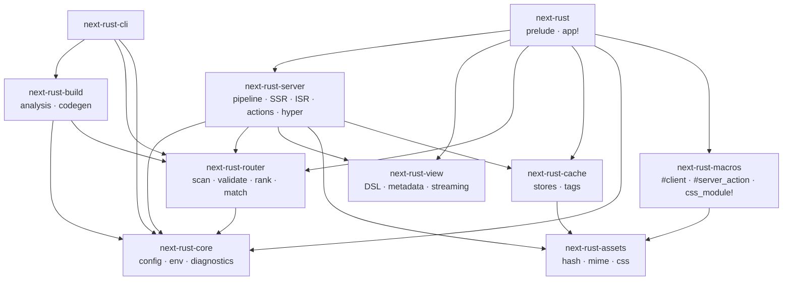

# Architecture

## Crate graph



Crates are split by dependency weight and by where they run:

- `next-rust-build` (syn) and `next-rust-cli` never end up in the
  application binary.
- `next-rust-view` depends only on `futures-util`, so it can render HTML
  outside a server (emails, tests) and could compile to `wasm32`.
- `next-rust-router` has no async or I/O dependencies beyond `std::fs`
  scanning, and is shared by the build, the CLI and the runtime.
- `next-rust-assets` has **zero** dependencies and is shared by the
  procedural macros (compile time) and the server (runtime).

## Build pipeline

```text
app/ directory
    │  next-rust-router::scan_project
    ▼
RouteNode tree ── flatten ──▶ Vec<Route> ── validate ──▶ diagnostics (NR01xx)
    │  next-rust-build::analyze (syn: signatures, consts, #[server_action])
    ▼
Project { routes + rendering modes + exports } ── check_exports ──▶ diagnostics (NR02xx)
    │  generate_code
    ▼
$OUT_DIR/next_rust_routes.rs     #[path = "/abs/app/page.rs"] mod m0; …
    │                            fn __render_m0_Page(ctx) -> BoxFuture<Result<Node>> { … }
    │                            pub fn routes() -> Routes { … }
    ▼
cargo/rustc  ── type checks every page against its extractors ──▶ server binary
    │  next-rust build: binary --export
    ▼
.next-rust/{server, static, cache/pages, manifest}
```

Design decisions:

1. **Special files are real modules**, included with absolute `#[path]`
   attributes. This supports an app directory anywhere on disk,
   directory names that aren't Rust identifiers (`[slug]`, `(group)`), and
   Unicode and spaces, with no file copying. Editor tooling keeps working
   because the files are ordinary Rust.
2. **Signature analysis instead of type-level tricks.** `syn` reads each
   exported function's arguments. The generator emits a direct call with one
   `FromContext::from_context(&ctx)?` per argument, so the compiler checks
   every extractor. There are no `Handler` trait towers with 16-arity impls,
   and error messages point at a single call.
3. **Rendering mode inference** is syntactic: argument types are classified
   as request-bound or not. Runtime `DynamicUsage` errors back it up if
   inference is bypassed.
4. **Deterministic output.** Directory entries are sorted, maps are
   `BTreeMap`s, and the generated file is rewritten only when its content
   changes, which avoids needless recompiles.

## Request lifecycle

```text
hyper connection (HTTP/1.1 keep-alive or HTTP/2)
  └─ App::handle_hyper: request timeout, request log, gzip
      └─ App::handle
          ├─ CSP nonce, body limit
          ├─ pre-routing: base path, /_nr/* framework assets, [[redirects]], trailing slash
          ├─ global middleware stack (App::middleware + plugins + app/middleware.rs)
          │   └─ RouteEndpoint::dispatch
          │       ├─ /_nr/action/* → CSRF check → action handler
          │       ├─ sitemap.xml / robots.txt generators
          │       ├─ intercepting routes (soft navigation headers)
          │       ├─ trie match → page | API | programmatic route
          │       │    └─ nested middleware.rs stack → endpoint
          │       │         page: static? → page store (HIT/STALE/MISS) : render
          │       ├─ public/ file
          │       └─ 404 page
          └─ finish: Set-Cookie from the shared jar, [[headers]], security headers
```

Page rendering (`render.rs`):

1. Metadata functions for every segment run concurrently, then merge root to leaf.
2. `render_level` recurses from the root segment to the page. At each level
   it wraps the level below in a suspense boundary (if `loading.rs` and
   streaming), applies `not-found.rs` and `error.rs` boundaries, wraps in
   `template.rs`, renders slots, and calls `layout.rs`.
3. The resulting `Node` tree goes to `stream_document`. It serializes the
   shell, hoists used stylesheets into `<head>`, and streams resolved
   boundaries as they complete (`FuturesUnordered`).

## Runtime choice: Tokio + hyper

- **Tokio** is the most widely deployed Rust async runtime, with mature I/O,
  timers, signal handling and ecosystem support (database drivers, HTTP
  clients). Most crates users will call from pages already require it.
  The framework's public API exposes plain `Future`s, `Request`/`Response`
  and `BoxFuture`. Tokio is used inside `next-rust-server` (listener,
  timers for SSE and timeouts, background ISR regeneration, jobs) and by the
  file cache store. The view layer, router and build tooling don't depend on
  it, and any executor that can drive Tokio-compatible futures can call
  `App::handle`.
- **hyper 1.x** provides production-grade HTTP/1.1 and HTTP/2 without a
  framework on top. Next Rust owns routing, middleware and rendering, so
  axum or actix would add a second, competing abstraction layer.

## Dependencies

Every external dependency, with its reason. Mature protocol implementations
are reused, not reimplemented. Small utilities (dates, `.env`, CSS, cookies,
hashing, MIME types, argument parsing) are implemented internally, because
their total size was a few hundred lines each.

| crate | used by | why | alternatives considered |
|---|---|---|---|
| `tokio` | server, cache | async runtime, networking, timers, signals, fs | async-std (less maintained), smol (smaller ecosystem) |
| `hyper`, `hyper-util` | server | HTTP/1.1 + HTTP/2 server, upgrades, graceful shutdown | writing HTTP parsing (security risk) |
| `http`, `http-body`, `http-body-util` | server | standard request/response types used across the ecosystem | — |
| `bytes` | server | zero-copy body buffers (required by hyper) | — |
| `futures-util` | view, server | `FuturesUnordered`, stream combinators for streaming SSR | hand-written executor combinators |
| `serde`, `serde_json` | most | config, manifests, JSON APIs, action I/O | — |
| `serde_urlencoded` | server | query strings and forms into typed structs | internal parser (edge cases in encoding) |
| `toml` (parse only) | core | `next-rust.toml` | — |
| `getrandom` | server | CSPRNG for nonces, CSRF tokens, session ids, digests | `rand` (larger) |
| `syn`, `quote`, `proc-macro2` | build, macros | parsing Rust source and generating code | regex-based parsing (fragile) |
| `flate2` (feature `compression`, default) | server | gzip with pure-Rust miniz backend | brotli (larger, C deps in common crates) |
| `tokio-tungstenite` (feature `websocket`) | server | RFC 6455 WebSocket protocol | — |
| `tracing` (feature `tracing`) | server | ecosystem-standard instrumentation | — |

All dependencies are MIT and/or Apache-2.0 licensed and actively maintained
at the time of writing. Default features are disabled where possible (`toml`
parse-only, `tokio` feature-selected, `futures-util` without executor).

The CLI has no dependencies beyond the framework crates and serde. It uses
`std::process` and polling instead of `clap`, `notify` or an async runtime.

## Frontend runtime

`/_nr/runtime.js` is one dependency-free ES module (~4 KB gzipped) with four
responsibilities: client navigation, streaming swaps after navigation, form
and action enhancement, and island hydration. It never uses `eval` or
`new Function`. Island hydration is attribute-driven, or delegated to ES
modules through the `hydrate(element, props)` contract, which WASM glue code
can implement. The streaming swap function is separate and inlined (~150
bytes) only on pages that suspend, so streaming works without the runtime.
